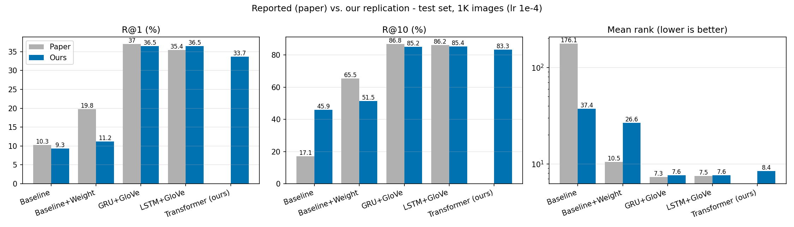

# Neural Caption-Image Retrieval

**UE24CS352A: Machine Learning, Mini-Project**

Type a sentence, get the matching photos. This project replicates the caption-to-image retrieval models from *"Neural Caption-Image Retrieval"* (Qian & Lamberti, Stanford CS229) and extends them with one additional model of our own: a Transformer caption encoder.

**Team:** ` Chirag Arun Yadwad(PES2UG24CS136)` and `Diya J Marar (PES2UG24CS162)`
**Section:** `C`  |  **Faculty:** `Dr. Nazmin Begum`

---

## Overview

Given a text query such as *"a dog sitting on a couch"*, the system searches a database of 1,000 images and returns the best matches.

Images and sentences are both converted into vectors in a shared 1,024-dimensional space. The model is trained so that a photo and its own caption end up close together, and a photo and an unrelated caption end up far apart. At search time the query is embedded and the nearest images are returned.

```
photo   -> VGG19 features (4096) -> linear layer ------------+
                                                              +--> shared space -> nearest images
caption -> GloVe -> GRU / LSTM / Transformer -> sentence vec -+
```

## Models

| Model | Description | Role |
|---|---|---|
| Baseline | Average of the caption's GloVe vectors, mapped to the image feature space with (ridge) linear regression | Replication |
| Baseline + Weight | Same, but averaging the predictions of all 5 captions of an image | Replication |
| GRU + GloVe | GRU caption encoder, GloVe-initialised and fine-tuned word vectors, margin ranking loss | Replication |
| LSTM + GloVe | Same, with an LSTM | Replication |
| **Transformer + GloVe** | Transformer caption encoder (2 layers)| **Our extension** |

**Loss (GRU, LSTM, Transformer):** pairwise hinge (margin) ranking loss with in-batch negatives, using the similarity S(i, c) = -||f_i(i) - f_c(c)||². Margin = 0.1.

## Dataset

- **MS COCO**: 123,287 images, 5 human-written captions each. Standard split: 113,287 train / 5,000 validation / 5,000 test images (566,435 / 25,000 / 25,000 captions).
- **Image features:** precomputed 10-crop VGG19 fc7 features (4096-d per image), released with the order-embeddings work. They are already averaged over the 10 crops.
- **Word vectors:** GloVe (6B tokens, 300-d). 22,012 of the 26,928 training-vocabulary words are found in GloVe; the rest get small random vectors.

## Repository structure

```
.
├── README.md
├── requirements.txt
├── code/
│   ├── main.py                  # entry point: train a model
│   ├── trainer.py               # training loop, checkpointing, early stopping
│   ├── dataset.py               # data loading, vocabulary, GloVe
│   ├── models.py                # image encoder, GRU/LSTM caption encoder, ranking loss
│   ├── evaluation.py            # Recall@K and mean rank
│   ├── baseline.py              # averaged GloVe + linear regression baseline
│   ├── extra_model.py           # our Transformer caption encoder (extension)
│   ├── eval_only.py             # evaluate a saved model on the test set
│   └── eval_custom_input.py     # interactive demo: type a caption, get top-10 image indices
└── results/                     # training logs and test results
```

## Setup

1. Clone the repository and install the requirements:

```
   git clone https://github.com/diya-jm/Image-Caption-Retrieval.git
   cd Image-Caption-Retrieval
   pip install -r requirements.txt
```

2. Download the dataset (about 1 GB) into the repository root and unzip it. This creates `data/coco/`:

```
   wget http://www.cs.toronto.edu/~vendrov/order/coco.zip
   unzip coco.zip
```

3. Download the GloVe vectors from https://nlp.stanford.edu/projects/glove/ (`glove.6B.zip`) and place `glove.6B.300d.txt` in `data/`.

A GPU is needed for training (we used a Google Colab T4).
`data/`, checkpoints and GloVe are git-ignored and are not part of the repository.

## Usage

Run everything from the `code/` folder.

```
cd code

# Baselines
python baseline.py --glove ../data/glove.6B.300d.txt

# Replicated models
python main.py --rnn gru  --glove ../data/glove.6B.300d.txt
python main.py --rnn lstm --glove ../data/glove.6B.300d.txt

# Our extension (note the lower learning rate)
python main.py --rnn transformer --glove ../data/glove.6B.300d.txt --lr 0.0001

# Evaluate a saved model on the test set
python eval_only.py --ckpt ../checkpoints/gru_glove.pt

# Interactive demo (prints the indices of the top-10 test images)
python eval_custom_input.py --ckpt ../checkpoints/gru_glove.pt
```

Training options: `--epochs`, `--batch`, `--lr`, `--margin`, `--dim`, `--patience`, `--ckpt` (where to save the best model). Run `python main.py --help` for the full list.

## Training setup

| Setting | Value |
|---|---|
| Optimiser | Adam |
| Learning rate | 0.001 (GRU, LSTM), 0.0001 (Transformer) |
| Batch size | 128 captions |
| Margin | 0.1 |
| Embedding dimension | 1,024 (images and captions) |
| Max epochs / early stopping | 30 / stop if val R@10 does not improve for 5 epochs |
| Model selection | best validation R@10 (first 1K validation images) |
| Gradient clipping | max norm 2.0 |
| Seed | 0 (single run per model) |
| Hardware | Google Colab T4 GPU |

Epoch time: about 120 s (GRU/LSTM) and about 191 s (Transformer). The GRU stopped after 20 epochs (best epoch 15, val R@10 83.1), and the Transformer after 24 (best epoch 19, val R@10 85.5).

## Evaluation

We report **Recall@K** (R@K): the percentage of caption queries for which the correct image is among the top K retrieved images, and the **mean rank** of the correct image (lower is better). Each query searches a database of 1,000 images, and results are averaged over the five 1K folds of the 5,000-image test set. We did not verify this fold protocol line by line against the reference implementation.

## Results

Test-set results. "Paper" values are from Table 1 of the reference paper; "Ours" are from our own runs.

| Method | R@1 (paper) | R@1 (ours) | R@10 (paper) | R@10 (ours) | Mean rank (paper) | Mean rank (ours) |
|---|---|---|---|---|---|---|
| Baseline | 10.3 | 9.3 | 17.1 | 45.9 | 176.1 | 37.4 |
| Baseline + Weight | 19.8 | 11.2 | 65.5 | 51.5 | 10.5 | 26.6 |
| GRU + GloVe | 37.0 | 30.6 | 86.8 | 80.3 | 7.3 | 9.7 |
| LSTM + GloVe | 35.4 | 30.4 | 86.2 | 80.5 | 7.5 | 10.1 |
| **Transformer + GloVe (ours)** | n/a | **33.7** | n/a | **83.3** | n/a | **8.4** |

Full R@5 values for the neural models: GRU 65.9, LSTM 66.2, Transformer 69.9.



### Reported vs. obtained: discussion

**What matches.** The overall picture of the paper is reproduced: the GRU and LSTM encoders are far better than the averaged-GloVe baselines, and the GRU and LSTM perform very similarly to each other (as in the paper, the difference is about a point or less in our runs).

**What differs.**
- **GRU and LSTM are 3 to 6 points below the paper** (for example GRU R@10: 80.3 vs 86.8). Likely reasons: we used a learning rate of 0.001, whereas the paper reports 0.05; we added gradient clipping, which is not in the paper; our tokenisation and handling of words missing from GloVe are our own simple choices; and each model was trained once with one seed. We did not run experiments to confirm which of these matters most.
- **Baseline:** our plain baseline has a similar R@1 (9.3 vs 10.3) but much better R@10 and mean rank than the paper's (45.9 vs 17.1, 37.4 vs 176.1). Our "Baseline + Weight" is *worse* than the paper's. The paper does not specify its baseline in full (regularisation, handling of unknown words, how captions are combined), so our implementation (closed-form ridge regression, regularisation 1.0, random vectors for unknown words) probably differs from theirs. The paper's own baseline row looks unusual (R@1 10.3 but R@10 only 17.1).
- The accompanying poster reports lower R@10 values (75.7% and 78.0%) than the paper's table. The poster appears to be an earlier, in-progress version, so we compare against the paper's Table 1.
- The baseline was evaluated on the test set and its regularisation was not tuned.

## Our extension: Transformer caption encoder

**What it is.** The paper's caption encoder is a recurrent network that reads a sentence word by word and keeps a running memory. We replaced only this component with a small Transformer encoder (`code/extra_model.py`): GloVe-initialised (fine-tuned) word vectors are projected to 512 dimensions, learned position vectors are added, and 2 self-attention layers (8 heads, feed-forward size 1024, dropout 0.1) let every word attend to every other word. The word vectors are then averaged over the real (non-padding) words and mapped to the 1,024-d shared space. The image encoder, loss, data, splits and metrics are identical to the GRU and LSTM runs, so the comparison isolates the sentence encoder.

**Why we chose it.** Transformers are not used in the reference paper, and they are a natural, easily explained swap for the recurrent encoder. Self-attention lets words such as "guy", "bike" and "train" interact directly, which may help with multi-object captions, and averaging over words avoids relying on a single last hidden state.

**Result.** The Transformer is the best model we trained: R@1 33.7, R@10 83.3 and mean rank 8.4 on the test set, compared with 30.6 / 80.3 / 9.7 for the GRU and 30.4 / 80.5 / 10.1 for the LSTM. It also reached a higher validation R@10 (85.5 vs 83.1 for the GRU). It still falls short of the paper's GRU numbers (R@10 86.8), but it closes much of the gap.

**Caveats.**
- These are single runs with one seed. The gap to the GRU (about 3 points) is larger than the epoch-to-epoch fluctuation we saw (1 to 2 points) but we did not repeat the runs, so we cannot give a confidence interval.
- The Transformer used a lower learning rate (0.0001) than the GRU and LSTM (0.001), so the comparison is not perfectly controlled.
- The Transformer is about 60% slower per epoch and has more parameters.
- Why it is better is a hypothesis (direct word-to-word attention, averaging over words), not something we tested with an ablation.
- Its training loss kept falling after the validation score levelled off (mild overfitting); early stopping selected the best epoch.

## Demo

`code/eval_custom_input.py` loads a trained model, embeds the first 1,000 test images, and prints the indices of the 10 images closest to a typed query. The download we used contains only precomputed image features, not the photos themselves, so the demo currently shows image indices rather than pictures.

## Limitations and possible future work

- Single seed per model; no repeated runs or significance testing.
- Hyperparameters were not tuned (learning rates differ from the paper, and between the Transformer and the RNNs).
- Image features are fixed VGG19 features; attention over image regions or stronger features (e.g. ResNet) were not explored.
- The demo shows image indices, not images.

## References

1. J. Qian and G. Lamberti, *Neural Caption-Image Retrieval*, Stanford CS229 project. Code: https://github.com/giacomolamberti90/CS229_project
2. I. Vendrov, R. Kiros, S. Fidler, R. Urtasun, *Order-Embeddings of Images and Language*, arXiv:1511.06361, 2015.
3. T.-Y. Lin et al., *Microsoft COCO: Common Objects in Context*, ECCV 2014.
4. K. Simonyan and A. Zisserman, *Very Deep Convolutional Networks for Large-Scale Image Recognition*, arXiv:1409.1556, 2014.
5. J. Pennington, R. Socher, C. Manning, *GloVe: Global Vectors for Word Representation*, EMNLP 2014.
6. K. Cho et al., *Learning Phrase Representations using RNN Encoder-Decoder*, arXiv:1406.1078, 2014.
7. A. Vaswani et al., *Attention Is All You Need*, NeurIPS 2017.